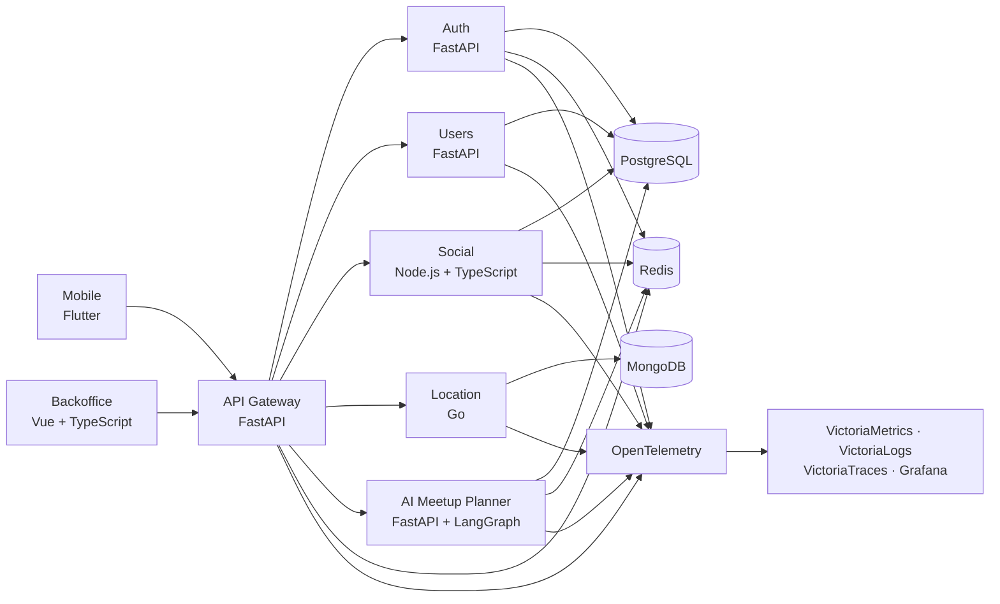

# Bumbledesa

Bumbledesa es una aplicación social de ubicación para compartir dónde estás con tus amigos y coordinar encuentros. El proyecto combina una app móvil, un backoffice y una arquitectura distribuida con servicios independientes, mensajería, observabilidad y un agente de IA con aprobación humana.

> Proyecto académico grupal desarrollado como un sistema completo: producto, backend, infraestructura, calidad y operación.

El código fuente de los repositorios de producto e infraestructura se mantiene privado. Este perfil presenta la arquitectura, las responsabilidades de cada componente y las principales capacidades del sistema.

## Arquitectura

El **API Gateway** es el único punto de entrada de los clientes. Valida JWT, consulta revocaciones y bloqueos en Redis, agrega la identidad autenticada y enruta cada request al servicio propietario del dominio.

## Repositorios

| Repositorio | Responsabilidad | Stack principal |
|---|---|---|
| `Bumbledesa-mobile` | Aplicación móvil, mapa, amistades, ubicación y meetups | Flutter · Dart · GoRouter |
| `Bumbledesa-backoffice-web` | Administración de usuarios y operación de la plataforma | Vue 3 · TypeScript · Vite · Pinia |
| `Bumbledesa-backend-gateway` | Autenticación en el borde, routing y proxy HTTP/SSE | Python · FastAPI · Redis |
| `Bumbledesa-backend-auth` | Registro, login, verificación, tokens, roles y credenciales | Python · FastAPI · PostgreSQL · Redis |
| `Bumbledesa-backend-users` | Perfiles, búsqueda de usuarios y términos | Python · FastAPI · PostgreSQL |
| `Bumbledesa-backend-social` | Amistades, preferencias, notificaciones, feedback y meetups | Node.js · TypeScript · Express · Prisma |
| `Bumbledesa-backend-location` | Ubicación, historial, consultas geoespaciales y puntos de encuentro | Go · chi · MongoDB |
| `Bumbledesa-backend-ai` | Agente planificador de encuentros con aprobación humana | Python · FastAPI · LangGraph · AWS Bedrock |
| `Bumbledesa-infra` | Entorno local, despliegue, configuración y observabilidad | Docker Compose · Kubernetes · Grafana · VictoriaMetrics |

## Capacidades destacadas

- Ubicación social en tiempo real, mapa de amigos, privacidad y modo fantasma.
- Gestión de perfiles, amistades, solicitudes, bloqueos y notificaciones push.
- Planificación asistida de encuentros: el agente combina participantes, disponibilidad y lugares, pausa para aprobación humana y recién entonces confirma el meetup.
- Coordinación de efectos distribuidos con outbox, reintentos, idempotencia y compensación ante fallos parciales.
- Autenticación centralizada en el gateway y límites de confianza explícitos entre servicios.
- Métricas, logs y trazas correlacionadas mediante OpenTelemetry, con dashboards operativos en Grafana.

## Desarrollo y calidad

El entorno completo se levanta desde `Bumbledesa-infra` con Docker Compose y un Makefile común. Los repositorios mantienen suites de tests unitarios e integración; la app móvil agrega pruebas E2E contra el stack real. GitHub Actions automatiza validaciones, cobertura, construcción de imágenes y despliegues según el componente.

La arquitectura es deliberadamente políglota: cada servicio usa un stack acorde con su responsabilidad y conserva la propiedad de sus datos.
